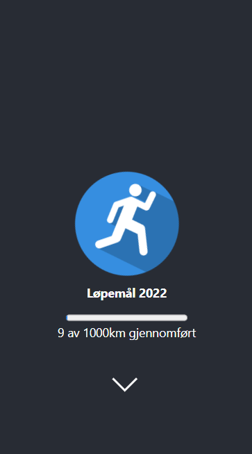

# Trening2022
 \
This project is meant for tracking and keeping the motivation for running throughout 2022. Hopefully the progressbar will be full, and a lot of memories is made in the meantime. The application is made in react⚛️

#### Test in your browser
<a href="https://trening2022.netlify.app/" target="_blank">trening2022.netlify.app</a>\
This version will be updated whenever I go for a new run. 👟 

#### Download
In the project directory, you can run:
`npm start`

Runs the app in the development mode.\
Open [http://localhost:3000](http://localhost:3000) to view it in your browser.

The page will reload when you make changes.\
You may also see any lint errors in the console. 

#### Functionality 
* [X] Dynamic progress bar 
* [X] Responsive for all platforms 
* [X] Seb is getting in better shape 💪

 

